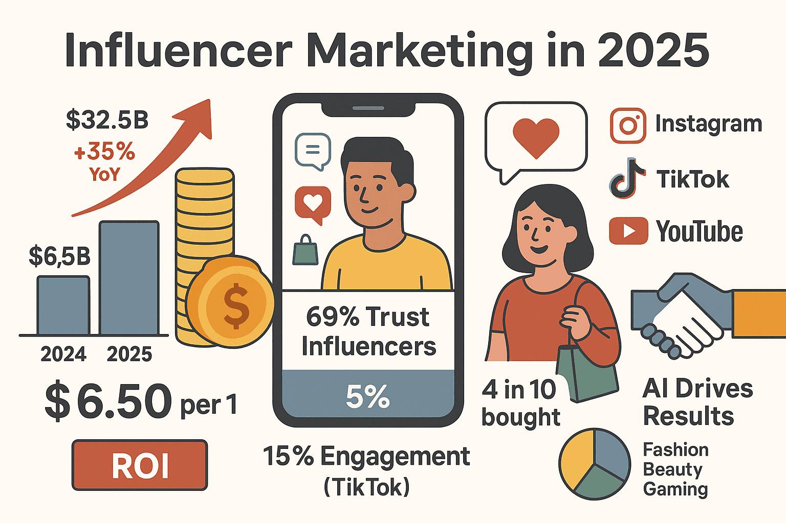
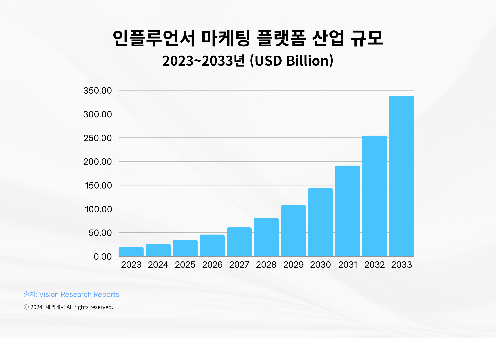
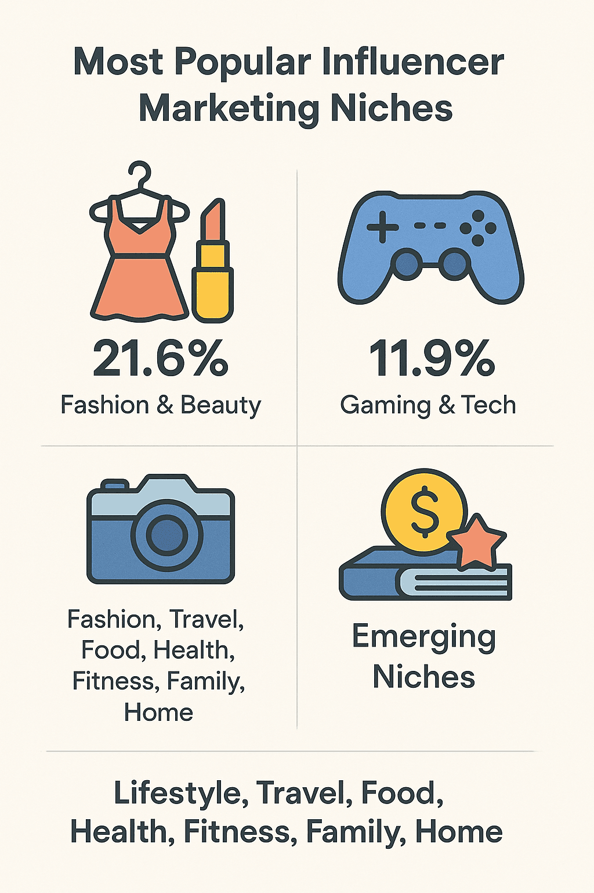
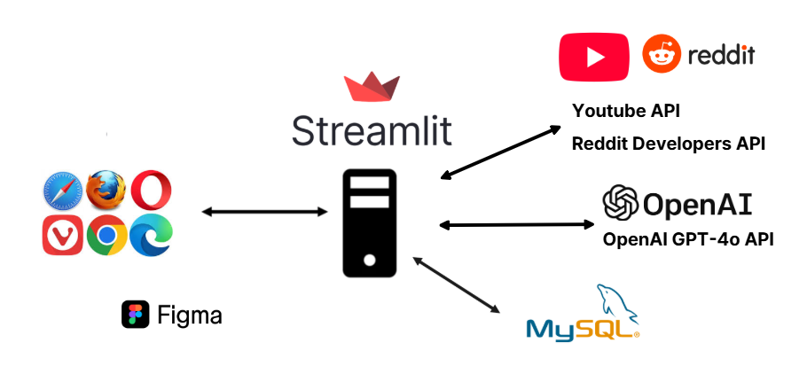

```
프로젝트 개요
프로젝트 기간: 2025-10-30 ~ 2025-11-06
팀명: 404 Found
참여 인원: 김민지, 문정환, 이유정, 이주현
주제: [생성형 AI를 활용한 화장품 마케팅 통합 최적화 솔루션]
```


프로젝트 일정
| 작업 항목 | 시작 날짜 | 종료 날짜 | 기간(일) |
|------------|------------|------------|-----------|
| 프로젝트 기획 및 문제 정의 | 2025-10-30 | 2025-10-31 | 2 |
| 화장품 산업 리서치 및 인사이트 도출 | 2025-10-31 | 2025-10-31 | 1 |
| Streamlit 대시보드 구현 | 2025-11-01 | 2025-11-05 | 4 |
| 데이터 수집 및 DB 설계 | 2025-11-04 | 2025-11-05 | 2 |
| Streamlit 코드 병합 | 2025-11-05 | 2025-11-05 | 1 |
| 발표 자료 및 보고서 작성 | 2025-11-05 | 2025-11-06 | 2 |
| 최종 점검 및 제출 | 2025-11-06 | 2025-11-06 | 1 |

---------------
# 프로젝트 주제 선정 과정
시장조사
전 세계 인플루언서 마케팅 시장은 2025년 약 325억 달러 도달할 전망이며, 매년 두 자릿수의 높은 성장률을 보임.



특히 K-뷰티 시장에서 가장 활발히 이루어지고 있음.
마이크로,나노 인플루언서(팔로워 5천 ~10만 명)이 대형 인플루언서보다 더 높은 참여율과 ROI를 보여주고 있어 캠페인의 대상 범위도 넓어지고 있음.

<p align="center">
  
</p>

문제 정의
기업들이 급성장하는 인플루언서 마케팅 시장에 막대한 비용을 투자하면서도 객관적 성과분석 체계가 부재하는 비효율성
화장품 기업 마케터들은 방대한 양의 해외 트렌드 정보와 복잡한 제품 성분 데이터를 바탕으로 정보를 빠르게 직관적인 인사이트로 전환하여 마케팅 전략을 수립하는 데 어려움을 겪고 있음
수립된 전략을 바탕으로 '최적의' 인플루언서를 선별하는 과정이 수작업으로 비효율적 운영


목표 및 기대효과: 
생성형 ai를 활용해 트렌드 분석부터 데이터 기반 인플루언서 시딩과 성과분석까지 원스톱 솔루션으로 기업의 투자 효율 극대화

    
마케터들의 업무 생산성 증진.

---------


프로젝트 아키텍쳐


# 🚀 AI 기반 마케팅/인플루언서 통합 솔루션 
> 이 프로젝트는 MySQL 데이터베이스와 GenAI(GPT-4o)를 통합하여, 데이터 수집부터 분석, 인플루언서 매칭, 성과 진단 및 계약서 생성까지 **마케팅 전반의 워크플로우를 자동화**하는 솔루션입니다.

# 프로젝트 수행방향
## 1. 역할분담

## 2. 개발 일정


# 프로젝트 설계
## 1. 프로젝트 구성도

## 2. 설계 프로그램 상세


## ✨ 주요 기능 및 특징 (Core Features)
```
* **MySQL 기반 데이터 통합:** 모든 인플루언서/제품/캠페인 성과 데이터를 MySQL에 통합 관리합니다.
* **GenAI 대화형 매칭:** 마케팅 목표를 자연어로 입력하면, AI가 자동으로 필터를 추출하고 가중치 기반으로 최적의 인플루언서를 추천합니다.
* **크로스 플랫폼 분석:** YouTube, Reddit 등 외부 소셜 미디어 데이터를 수집하고 분석하여 시장 인사이트를 제공합니다.
* **자동화된 보고서/계약:** AI가 브랜드 적합도, 심층 인사이트 리포트 및 국문 계약서 초안을 자동 생성합니다.
```
## 🛠 기술 스택 (Tech Stack)

| 구분 | 주요 기술 | 용도 |
| :---: | :--- | :--- |
| **백엔드/로직** | Python, Pandas, NumPy | 데이터 처리, 비즈니스 로직 구현 |
| **데이터베이스** | **MySQL (Streamlit Connection)** | 인플루언서 및 제품 데이터 영구 저장 |
| **프론트엔드** | **Streamlit** | 대시보드 형태의 웹 애플리케이션 구축 |
| **AI/API** | **OpenAI API (GPT-4o)** | 대화 분석, 키워드 추출, 심층 분석, 보고서/계약서 생성 |
| **외부 연동** | **Google API Client, PRAW** | YouTube 및 Reddit 데이터 수집 |
| **시각화/리포트**| Altair, Matplotlib, FPDF | 데이터 시각화 및 PDF 보고서 생성 |

## 📦 모듈별 상세 기능 요약

프로젝트는 5가지 주요 기능별 모듈로 구성되어 있으며, 각 모듈은 독립적인 기능을 수행합니다.

| 코드 번호 | 모듈 이름 | 핵심 기능 요약 | AI/분석 역할 |
| :---: | :--- | :--- | :--- |
| **1** | **제품 타겟 AI 분석** | DB 제품 정보 기반, **타겟 고객 상세 분석** 및 **유사 제품 추천 리포트** 자동 생성 (Excel/PDF) | GPT-4o로 타겟팅 정보(국가, 연령, 피부타입 등)를 구조화된 JSON으로 추출. |
| **2** | **Reddit 트렌드 분석** | PRAW를 이용한 Reddit 데이터 수집 및 캐싱. 키워드, 감성, 시간 트렌드 분석. | GPT-4o가 분석 결과를 조합하여 **국문/영문 임원진 보고서**를 생성. |
| **3** | **YouTube 트렌드 분석** | YouTube API로 영상 및 댓글 수집. 댓글 **동시출현/토픽 비교** 분석 및 **진정성 지표** 활용. | GPT-4o가 댓글 감성 및 통계 기반으로 **전략적 인사이트 보고서** 생성. |
| **4** | **AI 매칭 & 계약 관리** | **DB 연동**, **대화형 필터링**, **가중치 기반 랭킹** 모델 구현. 최종 후보에 대한 AI **브랜드 핏 평가** 및 **계약서 초안** 자동 생성. | GPT-4o가 자연어를 필터로 변환하고, 브랜드/인플루언서 적합도 심층 분석. |
| **5** | **성과 분석 대시보드** | 과거 캠페인 성과(KPI)를 로드/집계하여 **진정성 지수** 산출. **KPI 가중치 조정** 기능과 **AI KPI 요약 보고서** 생성. | GPT-4o가 전체 KPI 데이터 기반으로 **마케팅 효율성 진단 보고서**를 작성. |


# 설치 및 실행

## 1. 환경 구성
pip install streamlit pandas numpy openai fpdf altair google-api-python-client praw pymysql SQLAlchemy

## 2. 애플리케이션 실행
streamlit run app.py 


## 🧠 LLM (GPT-4o) 역할별 시스템 프롬프트 요약

이 프로젝트에서 각 모듈의 AI 모델에게 부여된 **전문가 역할** 및 **핵심 지시사항**입니다.

| 코드 | 모듈 역할 | AI 역할 (System Prompt Key) | 핵심 지시사항 |
|:---:|:---:|:---|---|
| **1** | 제품 타겟 분석 | **화장품 시장 분석 전문가** | 제품 정보를 분석하여 **JSON 스키마**에 맞춰 타겟 고객(국가, 연령, 피부 타입 등)을 상세 분석. |
| **2** | Reddit 보고서 | **Senior Executive Market Analyst** | 분석 데이터를 기반으로 **국문/영문**의 실행 가능한 **이중 언어 임원진 보고서**를 생성. |
| **3** | YouTube 보고서 | **Senior Executive Market Analyst specializing in YouTube Trends** | 댓글 성과 데이터를 분석하여 **국문/영문**의 **전략적 통찰력**을 담은 보고서를 생성. |
| **4** | AI 매칭/계약 | **Marketing Campaign Assistant** | 자연어 요청을 분석하여 필터 값 추출 후, **누락 정보에 대한 후속 질문**을 JSON 형태로 생성. |
| **5** | 성과 분석/KPI | **시니어 마케팅 AI 어시스턴트** / **CMO 보고 데이터 사이언티스트** | 마케팅 요청을 **텍스트 키워드/시각 태그** JSON으로 추출하며, KPI 기반 **마케팅 효율성 진단 보고서**를 작성. |

## ⚙️ 실행 환경 설정 (Getting Started)

### 1. 필수 환경 설정

프로젝트 실행을 위해서는 다음 API 키 및 DB 정보가 필요합니다. 모두 `.streamlit/secrets.toml` 파일에 설정해야 합니다.

```toml
OPENAI_API_KEY = "YOUR_OPENAI_API_KEY_HERE"

[connections.mysql_db]
# Streamlit DB Connection 설정
dialect = "mysql"
host = "your_mysql_host"
port = 3306
database = "your_database_name"
username = "your_username"
password = "your_password"

[youtube]
YOUTUBE_API_KEY = "YOUR_YOUTUBE_API_KEY_HERE"

[reddit]
client_id = "YOUR_REDDIT_CLIENT_ID"
client_secret = "YOUR_REDDIT_CLIENT_SECRET"
user_agent = "RedditAnalyzer_Streamlit" 
# username/password는 선택 사항입니다.

```